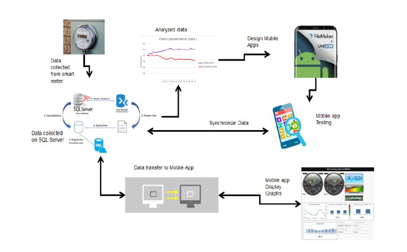
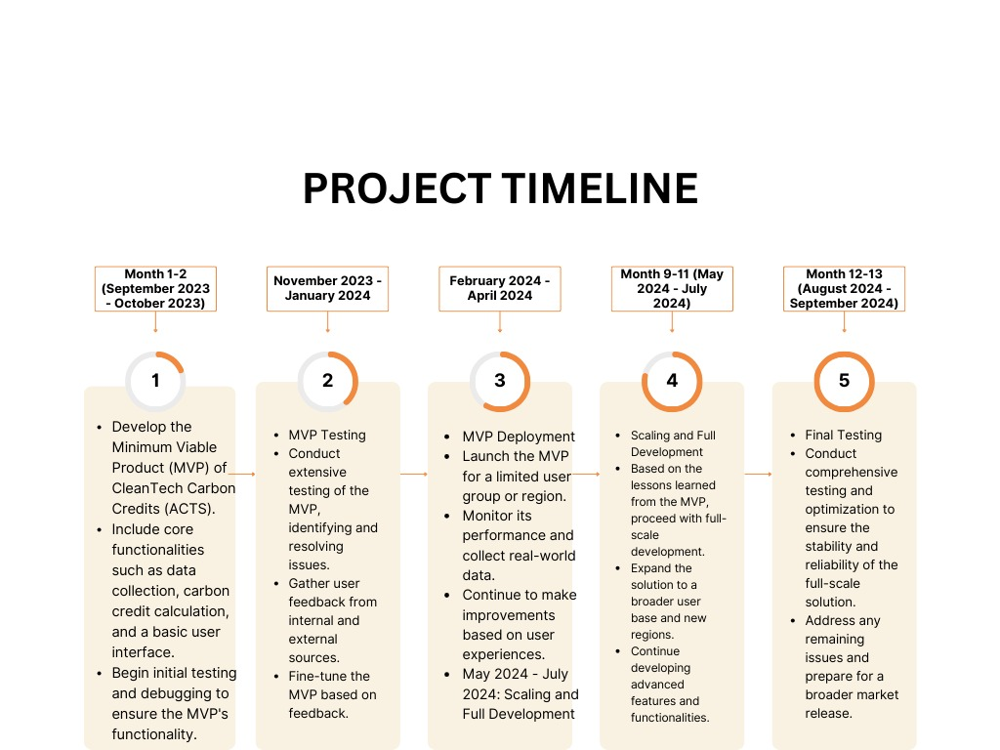

# AfricaCarbonTrade

## Contents
  - [Short description.](#short-description)
    - [How can technology help?](#how-can-technology-help)
    - [The idea](#the-idea)
  - [Demo video](#demo-video)
  - [The architecture](#the-architecture)
    - [The Problem](#the-problem)
    - [SOLUTION](#solution)
  - [Project roadmap](#project-roadmap)
  - [Live demo](#live-demo)
  - [Built with](#built-with)
    - [Online](#online)

## Short description.
The issue we aim to address is the challenge of quantifying and monetizing the environmental benefits of solar standalone systems through the generation of carbon credits. Our solution, AFRICA CARBON TRADE (ACT)  Carbon Credits, offers a comprehensive platform that empowers users to measure, trade, and benefit from their reduced carbon footprint, promoting clean energy adoption and combating climate change.

### Description of "How our technology solution can help"
Our technology enables carbon credit monetization, driving clean energy adoption

### The idea

Africa Carbon Trade (ACT) is an innovative solution that addresses the challenge of quantifying and monetizing the environmental benefits of solar standalone systems. It integrates cutting-edge hardware, software, and AI technology to monitor and measure energy consumption, production, and storage. The system calculates carbon emissions savings compared to fossil fuel generators and translates them into carbon credits, allowing users to quantify their positive impact and monetize these credits.

ACT aims to make clean energy solutions accessible to individuals and businesses. The AI assistant enhances the user experience by providing real-time interactions and insights about carbon credits, bridging the knowledge gap and enabling informed decisions. The platform also includes a marketplace for carbon credits, connecting users with the global carbon credit market, and allowing them to actively participate in carbon credit trading. A defining feature of Africa Carbon Trade (ACT) is the integration of a marketplace for carbon credits, bridging users with the global carbon credit market. Through the "Buy Credits" and "Sell Credits" functions, users can actively participate in the carbon credit economy, contributing to global carbon reduction efforts.

Beyond financial gains, ACT contributes to global carbon emissions reduction and climate change mitigation by promoting clean energy practices. It aligns with the United Nations' Sustainable Development Goals, particularly those related to clean energy, climate action, and sustainable development partnerships. The diverse team behind ACT brings expertise in hardware development, software engineering, climate knowledge, carbon finance, AI capabilities, and user interface design, all working towards making clean energy accessible and rewarding for everyone.

The Africa Carbon Markets Initiative (ACMI), launched at COP27, further strengthens ACT's commitment to driving change. ACMI aims to leverage voluntary carbon markets for financing Africa's energy, climate, and development objectives. ACMI aims to:
- Grow African credit retirements ~19-fold from 2020 to ~300 MtCO2e per annum by 2030 and up to 1.5-2.5 GtCO2e by 2050;
- Create or support 30 million jobs by 2030 and more than 100 million jobs by 2050 through the carbon project development, execution, certification, and monitoring;
- Raise the quality and integrity of African credits to mobilize up to USD 6 billion by 2030 and more than USD 100 billion per annum by 2050;
- Ensure equitable and transparent distribution of carbon credit revenue, with a significant portion of revenue going to local communities.

The alignment between Africa Carbon Trade (ACT) and the Africa Carbon Markets Initiative (ACMI) demonstrates the potential for ACT's scalability in Africa. Together, they work towards clean energy adoption, economic growth, and environmental responsibility, creating a brighter and sustainable future for the continent.

## Demo video

[Watch the video](https://youtu.be/L45RjkY0XrY?si=NBi5WpdLclf8Ii_g)

## The architecture
 - 

### The Problem

The issue we aim to address is the challenge of quantifying and monetizing the environmental benefits of solar standalone systems through the generation of carbon credits. Our solution, AFRICA CARBON TRADE (ACT)  Carbon Credits, offers a comprehensive platform that empowers users to measure, trade, and benefit from their reduced carbon footprint, promoting clean energy adoption and combating climate change.

### SOLUTION

AFRICA CARBON TRADE (ACT) is a transformative solution that addresses a pressing global issue: the challenge of quantifying and monetizing the environmental benefits of solar standalone systems. Our team recognizes that while solar power is a clean and sustainable energy source, its full potential remains untapped due to the difficulty of realizing and benefiting from the environmental advantages it offers. The carbon credit market is valued at billions of dollars, and AFRICA CARBON TRADE (ACT)  Carbon Credits presents a pioneering approach to leverage this market to empower individuals and organizations, reduce carbon emissions, and accelerate the transition to clean energy.

At its core, our solution offers a comprehensive and innovative platform that integrates hardware, software, AI technology, and a user-friendly interface. This solution enables system owners to accurately measure and track energy consumption, production, and storage from their solar standalone systems. The system calculates the carbon credits earned through substantial reductions in carbon emissions when compared to traditional fossil fuel-based generators. It effectively monetizes these carbon credits by allowing users to trade them on the global carbon credit market. As a result, users can benefit financially from their environmentally conscious practices while contributing to a cleaner, more sustainable world.

Our solution is designed with scalability and accessibility in mind. We recognize that for global impact, we need to ensure that it is accessible to a wide range of users, including those in underserved or remote areas. Our team is committed to making clean energy solutions affordable and empowering users to embrace clean energy practices, irrespective of their location or financial resources.

In addition to the core features, AFRICA CARBON TRADE (ACT)  Carbon Credits boasts an AI model integrated into the system. This AI assistant provides users with the ability to interact and gain valuable insights regarding their carbon credits. Users can ask questions, seek information, and receive real-time assistance, enhancing their understanding of carbon credit trading and clean energy practices. The AI model adds an educational component to our solution, helping users make informed decisions and maximize the benefits of their solar systems.

We envision a future where individuals and organizations can participate in the global carbon credit economy, where carbon credits are not only a measure of environmental responsibility but also a source of financial reward. Our solution fosters a sense of empowerment, turning solar power users into active contributors to global carbon reduction efforts. By simplifying the complex process of carbon credit trading and providing a user-friendly interface, we aim to bridge the gap between clean energy adoption and financial benefit.

The impact of AFRICA CARBON TRADE (ACT)  Carbon Credits goes beyond individual financial gains. By encouraging the adoption of solar standalone systems, we contribute to reducing global carbon emissions, combatting climate change, and accelerating the transition to a sustainable and carbon-neutral energy future. We're confident that our solution aligns with the United Nations' Sustainable Development Goals, particularly those related to clean energy, climate action, and partnerships for the goals.

The team behind AFRICA CARBON TRADE (ACT)  Carbon Credits is a diverse group of experts who are passionate about leveraging technology for a sustainable and clean energy future. Our members bring together a range of skills, including hardware development, software engineering, AI expertise, data analytics, and user interface design. We're dedicated to driving change and making a significant impact on the global carbon credit market and the clean energy sector.

In conclusion, AFRICA CARBON TRADE (ACT)  Carbon Credits is not just a technology solution; it's a catalyst for change. It offers a pathway to a cleaner, more sustainable future where clean energy practices are not only environmentally responsible but also financially rewarding. Our team is excited to be at the forefront of this transformative movement and is eager to contribute to reducing global carbon emissions and making clean energy accessible to all.

## Project roadmap

Project Roadmap: September 2023 - September 2024

September 2023 - October 2023: MVP Development and Testing

Month 1-2 (September 2023 - October 2023): MVP Development
Develop the Minimum Viable Product (MVP) of CleanTech Carbon Credits (ACTS).
Include core functionalities such as data collection, carbon credit calculation, and a basic user interface.
Begin initial testing and debugging to ensure the MVP's functionality.
November 2023 - January 2024: MVP Testing and Feedback

Month 3-5 (November 2023 - January 2024): MVP Testing
Conduct extensive testing of the MVP, identifying and resolving issues.
Gather user feedback from internal and external sources.
Fine-tune the MVP based on feedback.
February 2024 - April 2024: MVP Deployment and Market Integration

Month 6-8 (February 2024 - April 2024): MVP Deployment
Launch the MVP for a limited user group or region.
Monitor its performance and collect real-world data.
Continue to make improvements based on user experiences.
May 2024 - July 2024: Scaling and Full Development

Month 9-11 (May 2024 - July 2024): Scaling and Full Development
Based on the lessons learned from the MVP, proceed with full-scale development.
Expand the solution to a broader user base and new regions.
Continue developing advanced features and functionalities.
August 2024 - September 2024: Final Testing and Optimization

Month 12-13 (August 2024 - September 2024): Final Testing
Conduct comprehensive testing and optimization to ensure the stability and reliability of the full-scale solution.
Address any remaining issues and prepare for a broader market release.

## Live demo

You can find a running system to test at (https://cleantech-topaz.vercel.app/).

## Built with
### Online

- [App-ID] - it is implemented to protect user account, providing authorization and authentication
- [watson assistant AI]- Integrated into the app to interact with the users without the intervention of a live agent. 

- [React JS](https://reactjs.org) - JavaScript Library for building component base user interface
- [Tailwind css](https://tailwindcss.com/docs/installation) - Used for styling the user interface
- [Mongo DB](https://cloud.mongodb.com) - Database management system users
- [Render](https://cleantech-api-vzrf.onrender.com) - Host the backend api
- [Vercel](https://cleantech-topaz.vercel.app) - Host frontend app

### Github repositories
 FrontEnd [Africa Carbon Trade-online](https://github.com/Nurudeenissa/AfricaCarbonTrade.git) 
 
 IOT Codes [Africa Carbon Trade-IOT Codes](https://github.com/Nurudeenissa/IOT-codes.git)
